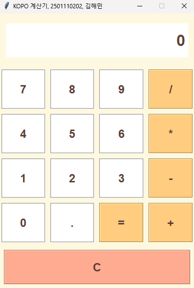
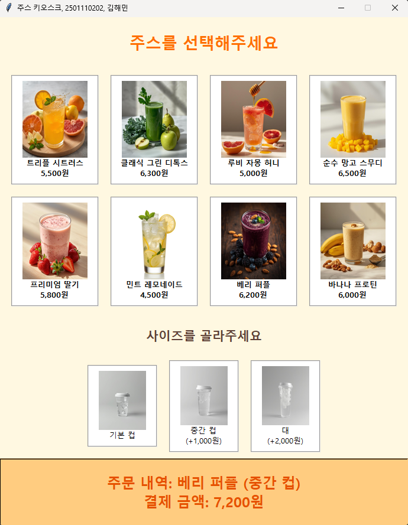

# Tkinter 계산기와 주스 키오스크

Python GUI 수업 과제로 작성한 계산기와 메뉴 선택형 키오스크. Python 3.10 이상을 개발 환경으로 사용했다.

## 계산기

`CalculatorApp`이 버튼 입력과 수식을 관리한다. 사칙연산·소수점·초기화, 0 나눗셈과 잘못된 수식의 오류 메시지를 처리한다.



## 주스 키오스크

`KioskApp`은 메뉴 가격과 사이즈 추가 요금을 딕셔너리로 보관한다. 메뉴·사이즈 선택 시 합계를 갱신하고 Pillow로 이미지를 읽는다. 이미지를 못 읽으면 대체 텍스트를 표시한다. 결제 API나 주문 DB는 없다.



## 실행

Tkinter가 포함된 Python과 데스크톱 화면이 필요하다. 키오스크는 Pillow를 추가로 설치한다. 이 폴더에서 실행한다.

```bash
python -m pip install pillow
python calculator/calculator.py
python juice_kiosk/juice_kiosk.py
```

`juice_kiosk.py`는 `__file__` 기준 상위 `assets/`를 읽는다. 현재 터미널 경로가 아니라 소스 파일 위치에 상대적인 경로다.

```text
calculator/calculator.py   계산기 UI와 이벤트
juice_kiosk/juice_kiosk.py 메뉴·가격·이미지 처리
assets/                   과일·컵 이미지
README/                  기존 실행 화면
```

자동 테스트와 패키징 설정은 없다. GUI를 띄우고 메뉴·사이즈·초기화·오류 입력을 직접 확인하는 과제다.
